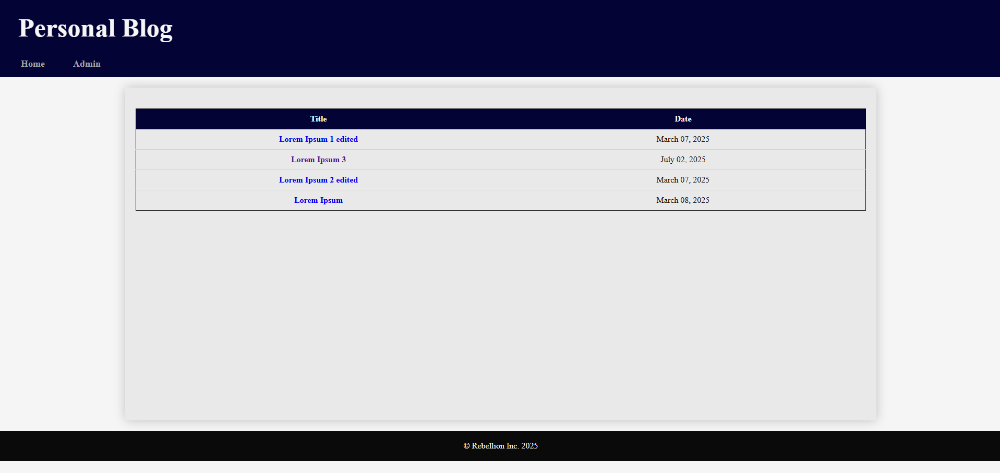

# [Ongoing] Personal Blog

A personal blog where one can write and publish articles. The blog has two sections: a guest section and an admin section.

- **Guest Section** — A list of pages that can be accessed by anyone:
- **Admin Section** — are the pages that only you can access to publish, edit, or delete articles.

### Implementation details: 

1. **Storage:** Each article is stored in seperate JSON on filesystem.
2. **Backend:** Returns HTML page to client. Thymeleaf to render the articles to frontend.
3. **Frontend:** HTML & CSS
4. **Authentication:** Session based on hardcoded username and password for the admin section.

### Technologies Used:
- **Frontend:** HTML, CSS, JS
- **Backend:** Java, Springboot, Apache Tomcat, MVC Architecture, JSON, Thymeleaf, Jackson
- **Source Code Management:** Git, GitHub, Maven, VS Code

### Installation
1. Clone the repo
```bash
git clone git@github.com:avinashee0012/PersonalBlog.git
cd PersonalBlog

```
2. Run war file
```bash
java -jar personalblog-0.0.1.war
```

3. Visit http://localhost:8080/

NOTE: If port 8080 is busy, another port will be used and can be found from terminal logs (see example below):


### Pages:

#### Guest Pages
1. Home Page


2. Article View Page


#### Admin Pages
1. Admin Login Page


2. Admin Dashboard Page


3. Create Article Page


4. Edit Article Page


_____
Some Bug Fixes:
- Publish Date should be have LocalDate type. Currently it's String.
- Content should be HTML formatted.

####
Project Idea: [roadmap.sh](https://roadmap.sh/projects/personal-blog) 